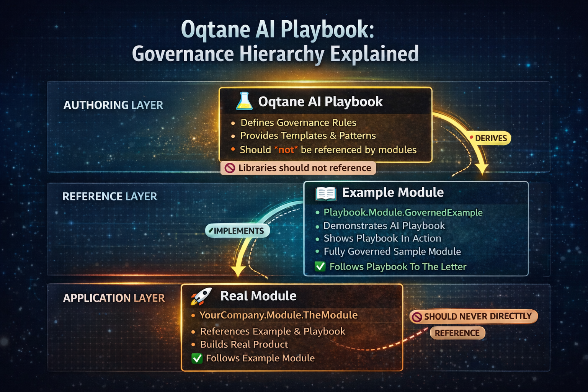
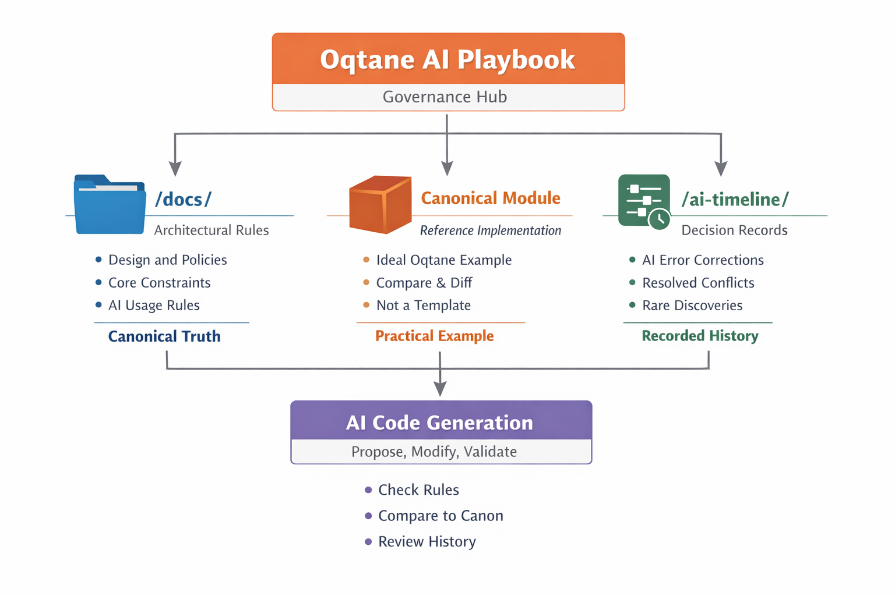

# Oqtane AI Playbook


> **This playbook aligns with the core principles of Oqtane as articulated in the Oqtane Philosophy — performance, flexibility, low ceremony, tool agnosticism, consistency, and practical engineering. See https://www.oqtane.org/blog/!/20/oqtane-philosophy for foundational context.**


**TL;DR for maintainers**

This repository defines **non-negotiable architectural and AI governance rules** for Oqtane module development.

If AI-generated output conflicts with this playbook or the canonical module reference, **the output is invalid-regardless of correctness**.

---


---

## What This Repository Is

A **framework-aware governance playbook** for building **robust, upgrade-safe Oqtane modules** - with or without AI assistance.

Its purpose is to make Oqtane's **implicit rules explicit**, enforceable, and visible to both **humans and AI tools**.

- This **is not** guidance.
- This repository **must never be referenced directly by modules.**
- **Do not** add this to your solution
- This **is a** playbook for **building playbooks**
- **This is authority**.

---



A three-layer overview showing how the Oqtane AI Playbook is used correctly:

- **Top (Authoring Layer)** The Oqtane AI Playbook defines governance rules, patterns, and constraints. It is the source of truth, but is never referenced directly by real modules.

- **Middle (Reference Layer)** Playbook.Module.GovernedExample is a living, fully-governed example that implements the playbook rules and demonstrates them in practice.

- **Bottom (Application Layer)** YourCompany.Module.GovernedExample builds real features by following the example module, inheriting its governance indirectly without coupling to the playbook itself.

The arrows highlight a strict flow: Playbook → Example → Real Module, ensuring consistency, safety, and adoption without friction.

---

## Why This Exists

Most Oqtane module failures are not caused by incompetence - they're caused by:

- Generic .netCore assumptions
- Hidden framework invariants
- Multi-tenant misunderstandings
- AI-generated code that *looks right- but violates Oqtane rules
- Tribal knowledge that isn't written down

AI accelerates all of these failures unless **explicitly constrained**.

This playbook exists to do exactly that.

---

## What This Is (and Is Not)

### This **is**:

- Framework-specific and grounded in real Oqtane behavior
- A set of **rejectable rules**, not “best practices”
- Designed to **constrain AI**, not empower it
- A canonical reference for review, enforcement, and correction
- A living document, informed by real failures

### This is **not**:

- A beginner tutorial
- A replacement for official Oqtane documentation
- A style guide
- An opinionated rewrite of the framework
- A claim of authority over Oqtane itself

---

## Who This Is For

This repository is useful if you:

- Build or maintain Oqtane modules
- Operate multiple Oqtane solutions
- Use GitHub AI assistant or other AI tools
- Want predictable, reviewable module code
- Have been burned by migrations, permissions, or background jobs

You do **not** need to agree with everything here to benefit from it.

---



---

## Repository Authority Model

When conflicts arise, authority is resolved **in this order**:

1. Canonical reference module
2. Playbook documentation (`/docs`)
3. Oqtane framework constraints
4. AI-generated output

**AI always ranks last.**

---

## Canonical Source of Truth

All architectural validation is performed against the **Oqtane Framework source code**, including:

- Oqtane.Client
- Oqtane.Server
- Oqtane.Shared
- Internal framework modules (e.g. HtmlText, Admin)
- Framework jobs, migrations, validation, and error handling

The framework itself is the **canonical implementation**.

---

## How to Use This Repository

### 1. Read the Documentation

The `/docs` folder contains a **numbered, ordered narrative**.

- File numbering is intentional and semantic
- Documents build on each other
- **Do not renumber, reorder, or reinterpret**

---

### 2. Use It as Governance

Most teams get the most value by:

- Referencing this repository in reviews
- Anchoring AI tools to these rules
- Treating violations as **hard failures**

This is where the playbook shines.

---

### 3. Adopt Incrementally

You do **not** need to rewrite existing modules.

Recommended approach:

- Freeze structure
- Enforce rules on new code
- Align old code only when touched

Governance over time beats perfection today.

---

## Using This Repository with AI

### Required AI Behavior

When this repository is present, AI **must**:

- Follow documented Oqtane patterns exactly
- Respect client/server boundaries
- Use permission-based authorization only
- Follow canonical startup, logging, and migration rules
- Treat the canonical module as a **validation reference**

AI **must not**:

- Invent new patterns or abstractions
- Introduce generic ASP.NET Core startup logic
- Add `Program.cs`, `Startup.cs`, hosted services, or background workers
- Replace explicit enforcement with “best practices”
- Renumber, reorder, or reinterpret documentation
- “Improve” architecture unless explicitly instructed

If AI output conflicts with this repository, **the repository always wins**.

---

## AI Governance Artifacts (Mandatory)

When adopting this playbook in a module repository, the following files **must exist and be visible to the AI**:

### AI Assistant Instruction Model

The Oqtane AI Playbook defines canonical AI assistant instructions used by governed module examples.

Real modules must reference these canonical instructions and may optionally extend them using
a module-owned `module-instructions.md` file.

This layered instruction model preserves a single point of truth while allowing intentional,
auditable customization at the module level.

```text
.github/
├── copilot-instructions.md <-- Referenced 
└── module-instructions.md

docs/
├── ai-decision-timeline.md
└── deviations.md
```

> 
> ⚠️ **Important**
> 
> AI tools can only reason over files that are visible in the editor/solution.
> 
> These files **must be included in the solution**, not just present on disk.
> 

---

## AI Decision Timeline (Optional but Strongly Recommended)

The **AI Decision Timeline** is a governance memory.

It records **non-trivial AI-assisted decisions**, including:

- Refused requests
- Rediscovered framework invariants
- Multi-iteration corrections
- Prevented architectural violations

This is **not a chat log**.

It is a **binding governance artifact**.

### AI Assistant Rejection Rule

If a request is refused or corrected due to architectural constraints:

- AI **must** reference the timeline
- AI **must** append a new entry using the canonical format
- AI **must not** proceed without validation

**One-line AI assistant prompt example**:

> 
> *“Before responding, read the AI Decision Timeline and treat it as binding governance memory.”*
> 

---

## Recommended Local Structure (Per Module)

Typical local development layout:

```text
D:\Oqtane Development\
├── Oqtane.Framework
└── AcmeCompany.Module.Example
```

Inside the module repository:

```text
.github/
└── copilot-instructions.md

docs/
├── governance/
│   ├── 027-rules-index.md
│   ├── 027x-canonical-validation.md
│   ├── 027x-migrations.md
│   ├── 027x-scheduled-jobs.md
│   └── ... (other 027x- rule files)
├── ai-decision-timeline.md
└── deviations.md
```

## What Each File Does

### `docs/governance/027-rules-index.md`

- **Authoritative index of all enforceable rules**
- If a rule is **not indexed here, it does not exist**
- Used by AI to discover which rule documents must be loaded

---

### `docs/governance/027x-*.md`

- Individual **enforceable rule documents**
- Each file:

    - Covers one domain (migrations, jobs, UI validation, etc.)
    - Contains explicit **Reject if** criteria
    - Is applied automatically once indexed

---

### `docs/ai-decision-timeline.md`

- Binding governance memory
- Records:

    - Refusals
    - Rediscovered invariants
    - Multi-iteration corrections
- **Append-only**
- Prevents reintroduction of rejected patterns

---

### `docs/deviations.md`

- Explicit, intentional deviations from canonical Oqtane patterns
- Each deviation must:

    - Be justified
    - Be scoped
    - Be accepted knowingly

---

## 🔐 Enforcement Rules (Critical)

- Governance files **must exist as files**, not folders
- Governance files **must be included in the solution**
- Governance files **must be visible at prompt time**
- Folder-only structures are ignored
- After changes, AI assistant **must be refreshed**

If governance files are not visible, **AI must refuse**.

The playbook is **referenced**, not copied.

---

## About AI and AI Assistant

AI tools:

- Optimize for plausibility
- Reuse familiar patterns
- Invent structure when uncertain

This repository exists to remove that uncertainty.

By providing:

- Canonical references
- Explicit rejection rules
- Enforceable constraints
- Historical governance memory

AI becomes a **productivity multiplier**, not a risk amplifier.

---

## AI Tool Support

This module demonstrates AI-governed development using multiple AI tools.

- GitHub Copilot instructions are defined in `.github/copilot-instructions.md`
- Amazon Q instructions are defined in `.amazonq/rules/instructions.md`

Both files act only as entry points.
All governance, rules, and prompts live under `/docs` and are tool-agnostic.

---

## Community and Contributions

This repository is intentionally open to evolution.

Contributions are welcome in the form of:

- Clarifications
- Corrections
- Edge cases
- Additional chapters
- Real-world failures and lessons learned

The goal is **shared understanding**, not personal ownership.

---

## Final Note

- Frameworks don't fail.
- Tools don't fail.
- Developers don't fail.
- **Unspoken rules fail.**


This repository exists to speak them out loud.
